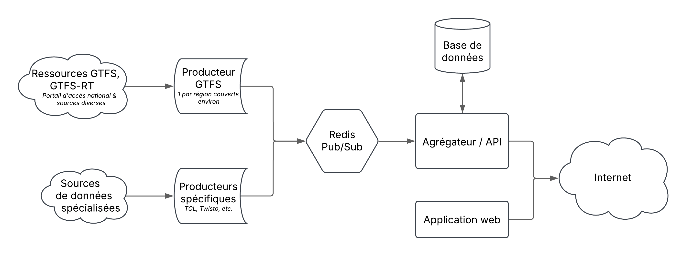

**Bus Tracker** is an application for tracking public transport vehicles that
leverages open data published by transport authorities and operators.

As of March 2025, it is available in most of the biggest French transit networks and tracks over 8k vehicles every day.

## Links

- Website: [https://bus-tracker.fr](https://bus-tracker.fr)
- Uptime: [https://uptime.bus-tracker.fr](https://uptime.bus-tracker.fr/status/bus-tracker)
- Discord: [https://discord.gg/DpwtEU4qBg](https://discord.gg/DpwtEU4qBg)
- E-mail: [contact@bus-tracker.fr](mailto:contact@bus-tracker.fr)

## How to run

Before running the project, please ensure:
- you have Docker Engine on your machine
- you run a decent version of Node (22+ preferrably)
- you have installed `pnpm`'s wrapper (`corepack enable`)

Now, to run the project:
1. Start the compose services: `docker compose up -d`
2. Build `@bus-tracker/contracts`: `pnpm -C libraries/contracts build`
3. Start the server app: `pnpm dev:server`
4. Start the client app: `pnpm dev:client`
5. Start one or more providers (e.g.: `pnpm dev:gtfs configurations/rouen-astuce.mjs`)
6. Head to [http://localhost:3000](http://localhost:3000)

## Tech architecture

Since the late 2024 rewrite, the app now uses Redis as a pub-sub mechanism for *providers* to send their data to the core server, whose responsibility is to aggregate and publish data to the end users.

## Around the app

These components are involved in Bus Tracker in some way:
- [GTFS-RT Generator – LiA (Le Havre)](https://github.com/kevinbioj/gtfsrt-lia)
- [GTFS-RT Generator – Astuce / TCAR (Rouen)](https://github.com/kevinbioj/gtfsrt-tcar)
- [GTFS-RT Generator – Île-de-France Mobilités (rail & subway only)](https://github.com/kevinbioj/gtfsrt-idfm)

## License

This app is licensed under the **General Public License 3.0**, please refer to [LICENSE](./LICENSE) for any more information.
